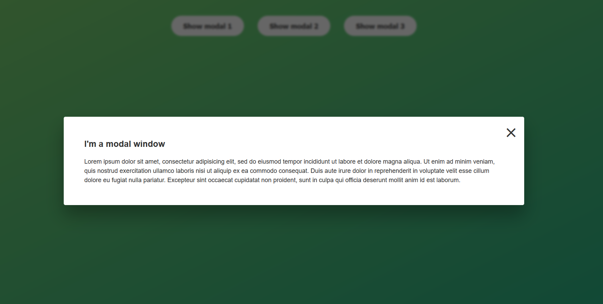

# Modal Window 🪟

## Overview

The "Modal Window" project is a simple yet effective demonstration of creating modal windows using HTML, CSS, and JavaScript. It's a great starting point for anyone looking to understand how modals work.

## Features

- Multiple buttons to trigger the modal
- Close modal with a close button or by clicking outside the modal
- Keyboard support to close the modal using the 'Escape' key

## Technologies Used

- HTML
- CSS
- JavaScript

## How to Use

1. Clone this repository

- git clone https://github.com/alexlux58/modal-window.git

2. Open `index.html` in your web browser.
3. Click any of the "Show Modal" buttons to display the modal.
4. Close the modal by clicking the close button, clicking outside the modal, or pressing the 'Escape' key.

## Contributing

Feel free to fork this repository and make your own changes. Pull requests are welcome!

## License

This project is open-source and available under the MIT License.

## Author

- [Alex](https://github.com/alexlux58)
